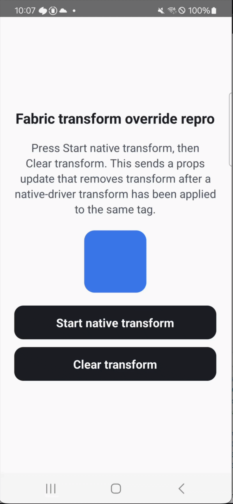
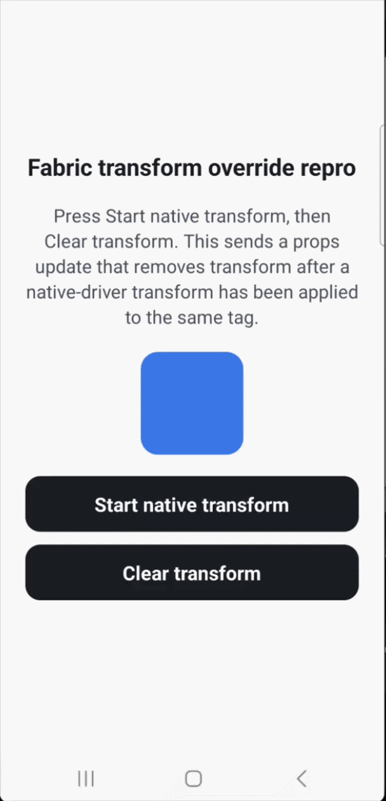

# React Native 0.85.3 Fabric Sync Props Transform Repro

This repository contains two Android-focused React Native 0.85.3 apps with the
same repro screen.

- `repro-crash`: unpatched crash repro app
- `repro-patched`: patched comparison app, using a Yarn patch for
  `react-native@0.85.3` and a Gradle composite build so Android uses the patched
  React Native source instead of the published Maven AAR

## Crash Hypothesis

This repro targets the Android Fabric synchronous mount props override path,
enabled by `overrideBySynchronousMountPropsAtMountingAndroid`.

Both Android apps load React Native with a custom Android feature flag provider
from `MainApplication`, before the React instance is created. That provider keeps
the stable New Architecture defaults and overrides
`overrideBySynchronousMountPropsAtMountingAndroid` to `true`, so the repro uses
the synchronous mount props override path even when React Native's stable
release-level defaults keep it disabled.

With `useNativeDriver: true`, Native Animated sends animated props through the
direct manipulation path:

1. `NativeAnimatedNodesManager` produces a `transform` prop for the animated
   view.
2. `UIManager::synchronouslyUpdateViewOnUIThread` forwards that prop through
   `Scheduler` and `FabricMountingManager`.
3. Android receives it in `FabricUIManager.synchronouslyUpdateViewOnUIThread`.
4. `SynchronousMountItem` calls
   `SurfaceMountingManager.storeSynchronousMountPropsOverride`, then
   `updatePropsSynchronously`.

When the feature flag is enabled, Android stores those synchronous Native
Animated props per tag so a later stale Fabric mount update cannot overwrite the
latest native animated value.

This repro then removes `transform` from React props for the same tag. Fabric
represents that removal as a `transform: null` props update. When the regular
Fabric update reaches `SurfaceMountingManager.updateProps`, the sync override
code sees stored synchronous props for that tag and tries to merge the stored
animated `transform` with the incoming props update. That merge path assumes a
prop that exists on both sides has the expected non-null type. For `transform`,
it expects an array because the stored Native Animated value was an array.

The crash happens because the incoming Fabric update still contains the
`transform` key, but its value is `null`. The synchronous override merge path
does not handle that removal case before asserting the incoming value type. On
Android, this fails inside
`SurfaceMountingManager.overridePropsReadableMap` while dispatching the Fabric
mount item:

```text
java.lang.AssertionError: Assertion failed
  at com.facebook.react.fabric.mounting.SurfaceMountingManager$Companion.overridePropsReadableMap
  at com.facebook.react.fabric.mounting.SurfaceMountingManager.updateProps
  at com.facebook.react.fabric.mounting.mountitems.IntBufferBatchMountItem.execute
```

The patched app fixes the stale override case generically: when an incoming
Fabric props update contains a stored synchronous prop key with a `null` value,
the patch removes that key from the stored synchronous override map and leaves
the `null` update intact. This preserves React's prop-removal semantics for
`transform`, `opacity`, and any future props stored in that override map.

The patched app also removes the per-tag synchronous override entry once all
stored keys have been cleared.

## Patch Layout

The patch lives in:

```text
repro-patched/.yarn/patches/react-native-npm-0.85.3-2292697f2f.patch
```

`repro-patched/android/settings.gradle` substitutes Android dependencies so the
patched app builds React Native from `node_modules/react-native`:

```text
com.facebook.react:react-android -> project(:packages:react-native:ReactAndroid)
com.facebook.react:hermes-android -> project(:packages:react-native:ReactAndroid:hermes-engine)
```

Without that substitution, the Android app can still use the published
`react-android` Maven AAR, which means the Yarn patch is present in
`node_modules` but not present in the installed APK.

## Repro Steps

1. Run the app.
2. Press `Start native transform`.
3. Press `Clear transform`.

This sends a native-driver `transform` update to a view, then removes
`transform` from props for the same tag.

## Recordings

- [crashed.gif](./crashed.gif)
- [patched.gif](./patched.gif)





## Commands

```sh
cd repro-crash
yarn android
```

```sh
cd repro-patched
yarn android
```

If the patched app still shows the old crash, clear the previous Android build
and rebuild the source-based React Native dependency:

```sh
cd repro-patched/android
./gradlew --stop
rm -rf ../node_modules/react-native/ReactAndroid/build/prefab-headers
./gradlew --no-parallel :app:assembleDebug
```
